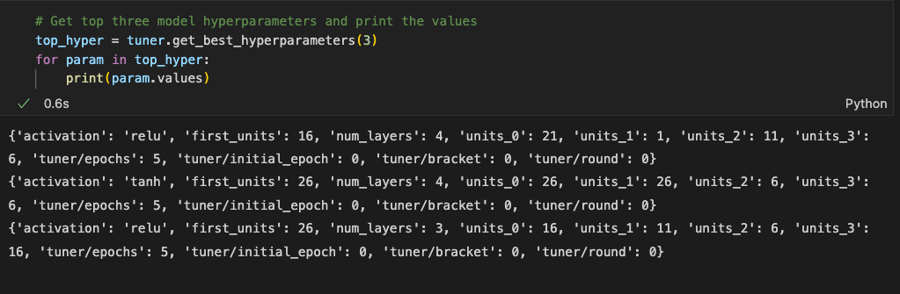

# Neural Networks
##  Creating Deep Learning Models to Evaluate Complex Data

This model spanned the distance from creating a basic neural network defined as using one hidden layer to fine-tuning more complex deep learning models that use several hidden layers.  

# Results

The project analyzed a dataset (available [here](​​https://2u-data-curriculum-team.s3.amazonaws.com/dataviz-online/module_19/charity_data.csv)) with over 34,000 rows and more than 40 columns to create a binary classifier that is capable of predicting with a 75% accuracy if applicants will be successful if funded by a group called AlphabetSoup.  

## Preprocessesing 

The difficult work to make an accurate machine learning model is in the preprocessing.  In this case, the function `OneHotEncoder` is used to fit and transform categorical data that otherwise couldn’t be handled by neural network programs.  

In the first instance of training and testing a model using three hidden layers  - using the Rectified Linear Unit (ReLu) and Sigmoid categorizing layer -  training the model over five epochs resulted in a model with 72.65% accuracy.

After attempting random attempts at optimization, including reducing additional ‘noisy’ columns to optimize the model performance as well as introducing more and different hidden layers, the result was a model that performed significantly worse than the original:

The last attempt at fine-tuning the model was to use the `Keras_Tuner` function from the Keras machine learning library and create a model to iterate through the dataset attempting every test method to deliver the proven best hyperparameters.  The downside of this method was the incredibly long time it took on a relatively small data set, making this an impractical choice in most real-world settings.  The final performance of the top three models was still under 73%:

